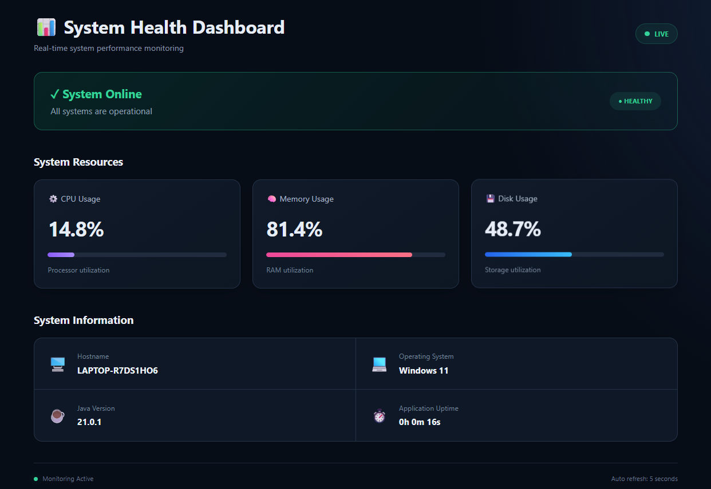

# 📊 System Health Dashboard

A real-time **System Health Monitoring Dashboard** built using **Java, Spring Boot, Thymeleaf, HTML, and CSS**.

The application displays live system resource information including CPU usage, memory utilization, disk usage, operating system details, hostname, Java version, and application uptime.

The project is designed as a hands-on Java and DevOps deployment project and can be deployed on an **AWS EC2 instance**.

---

## 🚀 Features

- ⚙️ Real-time CPU usage monitoring
- 🧠 Memory utilization monitoring
- 💾 Disk usage monitoring
- 🖥️ System hostname detection
- 💻 Operating system information
- ☕ Java runtime version
- ⏱️ Application uptime
- 🟢 System health status indicator
- 🔄 Automatic dashboard refresh every 5 seconds
- 📱 Responsive user interface
- 🌙 Dark DevOps-style monitoring dashboard

---

## 📸 Dashboard Preview



---

## 🛠️ Tech Stack

| Technology      | Purpose                         |
| --------------- | ------------------------------- |
| Java            | Backend programming             |
| Spring Boot     | Web application framework       |
| Thymeleaf       | Server-side HTML rendering      |
| HTML5           | Dashboard structure             |
| CSS3            | Dashboard styling               |
| Maven           | Build and dependency management |
| Embedded Tomcat | Application server              |
| Git             | Version control                 |
| GitHub          | Source code repository          |
| AWS EC2         | Cloud deployment                |
| Nginx           | Reverse proxy                   |

---

## 📂 Project Structure

```text
system-health-dashboard/
│
├── pom.xml
├── README.md
│
├── screenshots/
│   └── homepage.png
│
└── src/
    └── main/
        │
        ├── java/
        │   └── com/
        │       └── dashboard/
        │           ├── DashboardApplication.java
        │           └── DashboardController.java
        │
        └── resources/
            ├── static/
            │   └── style.css
            │
            ├── templates/
            │   └── dashboard.html
            │
            └── application.properties
```

---

## ⚙️ Prerequisites

Make sure the following are installed:

- Java 17 or later
- Maven
- Git

Check Java:

```bash
java --version
```

Check Maven:

```bash
mvn --version
```

---

## 💻 Run Locally

### 1. Clone the repository

```bash
git clone https://github.com/BhabajyotiKalita/system-health-dashboard.git
```

### 2. Navigate to the project

```bash
cd system-health-dashboard
```

### 3. Build the application

```bash
mvn clean package
```

### 4. Run using Maven

```bash
mvn spring-boot:run
```

Or run the generated JAR:

```bash
java -jar target/system-health-dashboard-1.0.0.jar
```

### 5. Open the dashboard

Open your browser and visit:

```text
http://localhost:4000
```

---

## 📊 Metrics Displayed

### CPU Usage

Displays the current processor utilization of the machine running the application.

### Memory Usage

Displays the percentage of physical memory currently being utilized.

### Disk Usage

Displays storage utilization for the filesystem used by the application.

### System Information

The dashboard also displays:

- Hostname
- Operating System
- Java Version
- Application Uptime

---

## 🔄 Automatic Refresh

The dashboard automatically refreshes every **5 seconds** to retrieve updated system metrics.

This allows CPU, memory, disk, and uptime information to update without manually refreshing the browser.

---

## ☁️ AWS EC2 Deployment

The application can be deployed on an Ubuntu AWS EC2 instance.

Deployment architecture:

```text
User / Browser
      │
      │ HTTP :80
      ▼
    Nginx
      │
      │ Reverse Proxy
      ▼
Spring Boot :4000
      │
      ▼
System Health Dashboard
```

When deployed to EC2, the dashboard displays resource information from the **EC2 instance itself**, including its CPU, memory, disk, hostname, operating system, and Java runtime.

---

## 🔨 Build

Generate the deployable JAR using:

```bash
mvn clean package
```

The JAR will be generated inside:

```text
target/
```

Run it with:

```bash
java -jar target/system-health-dashboard-1.0.0.jar
```

---

## 🎯 Project Purpose

This project was created to practice:

- Java application development
- Spring Boot
- Maven build management
- Server-side rendering with Thymeleaf
- Linux server deployment
- AWS EC2
- Git and GitHub
- Nginx reverse proxy configuration
- systemd service management
- Production-style Java application deployment

---

## 🔮 Future Improvements

Possible future enhancements include:

- CPU and memory history charts
- Network usage monitoring
- Disk space details
- System load average
- REST API for system metrics
- Docker containerization
- Jenkins CI/CD pipeline
- HTTPS support
- Prometheus metrics
- Grafana integration

---

## 👨‍💻 Author

**Bhabajyoti Kalita**

Java | Spring Boot | AWS | DevOps
